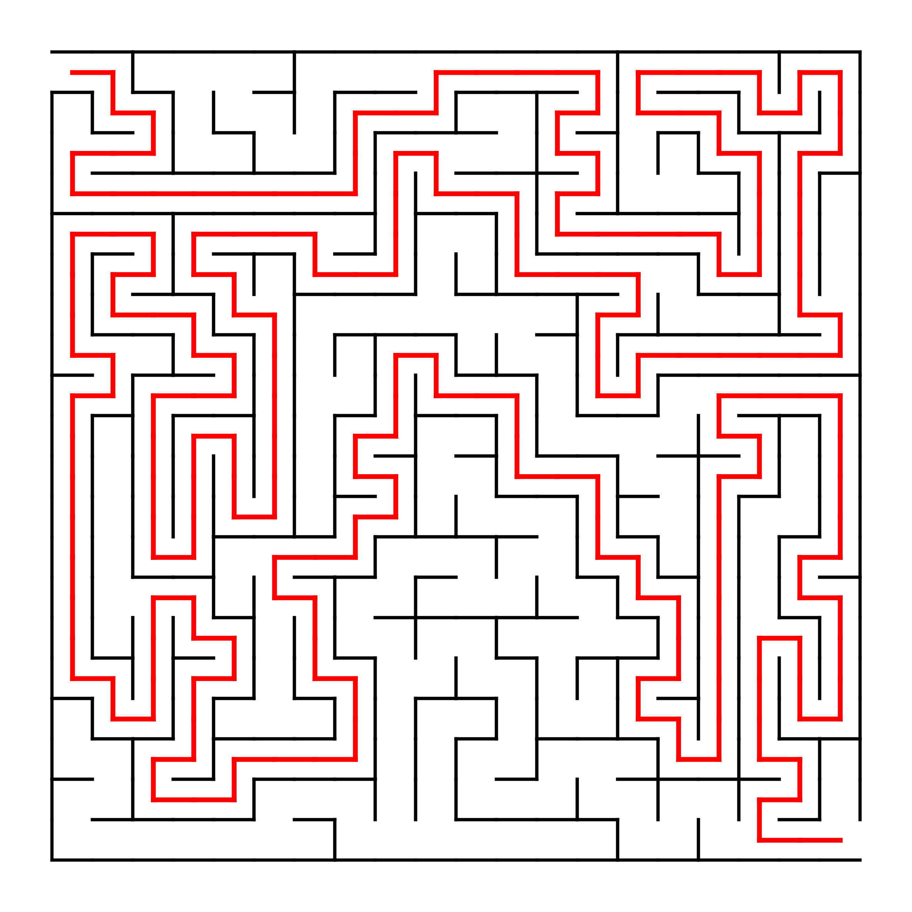

# Generator labiryntu za pomocą algorytmu DFS

## 1. Wstęp
**Cel projektu:**

Celem projektu było zaprojektowanie i implementacja generatora labiryntu za pomocą jednego z wymienionych algorytmów oraz wygenerowanie jego graficznej reprezentacji.

**Zakres projektu:**
- generowanie labiryntu za pomocą algorytmu DFS,
- reprezentacja labiryntu jako siatki komórek,
- wyszukiwanie ścieżki przez labirynt (funkcjonalność nadprogramowa),
- reprezentacja graficzna labiryntu wraz ze ścieżką.

<br>

## 2. Opis struktury projektu
```
Projekt/
│
├── main.py          # plik główny programu
├── maze.py          # klasa Maze
├── cell.py          # klasa Cell
├── generator.py     # generowanie labiryntu (DFS)
├── path.py          # wyszukiwanie ścieżki
├── render.py        # rysowanie labiryntu
└── directions.py    # definicja kierunków ruchu
```

<br>

## 3. Opis algorytmów

### 3.1 Generowanie labiryntu – DFS (`dfs()`)
Do wygenerowania labiryntu wykorzystano algorytm Depth-First Search (DFS) z mechanizmem nawrotów (backtracking). Algorytm rozpoczyna pracę od komórki początkowej (0,0), losowo wybiera nieodwiedzonego sąsiada, usuwa ściany pomiędzy komórkami i kontynuuje działanie aż do odwiedzenia wszystkich komórek.

**Złożoność czasowa:**  
O(n), gdzie *n* oznacza liczbę komórek labiryntu.

Labirynt wygenerowany przy użyciu algorytmu DFS jest określany jako labirynt doskonały. Oznacza to, że pomiędzy dowolnymi dwoma punktami istnieje dokładnie jedna ścieżka, nie występują pętle ani odizolowane obszary, a każda komórka jest osiągalna z każdej innej. W konsekwencji algorytm zawsze znajduje ścieżkę pomiędzy punktem startowym (0,0) a metą (m−1, n−1).

### 3.2 Wyszukiwanie ścieżki (`find_path()`)
Ścieżka pomiędzy punktem startowym a metą wyszukiwana jest za pomocą algorytmu DFS. Algorytm porusza się wyłącznie przez komórki, pomiędzy którymi nie występują ściany.

**Złożoność czasowa:**  
O(n), gdzie *n* oznacza liczbę komórek labiryntu.

<br>

## 4. Struktury danych

### 4.1 Klasa `Cell`
Każda komórka labiryntu przechowuje informacje dotyczące:
- obecności ścian w czterech kierunkach (`N`, `S`, `E`, `W`),
- stanu odwiedzenia komórki.

### 4.2 Klasa `Maze`
Klasa `Maze` przechowuje:
- informacje o rozmiarze labiryntu (`rows`, `cols`),
- dwuwymiarową listę obiektów klasy `Cell`.

<br>

## 5. Wizualizacja (`draw_maze()`)
Do wizualizacji labiryntu wykorzystano bibliotekę `matplotlib`. Ściany labiryntu przedstawione są jako czarne linie, natomiast odnaleziona ścieżka zaznaczona jest kolorem czerwonym.

Wizualizacja zapisywana jest do pliku graficznego `maze.png`.

<br>

## 6. Instrukcja uruchomienia
1. Zainstaluj język Python w wersji minimum 3.11.
2. Zainstaluj wymaganą bibliotekę `matplotlib`. Dla systemu operacyjnego **Windows**:
```
pip install matplotlib
```
3. Uruchom program:
```
python main.py
```

### 7. Przykładowy wynik programu
